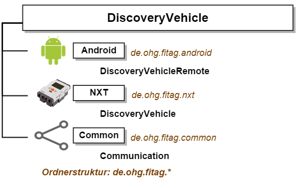
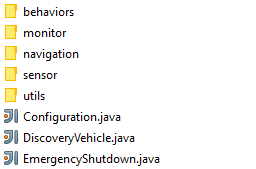
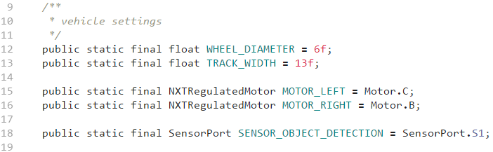
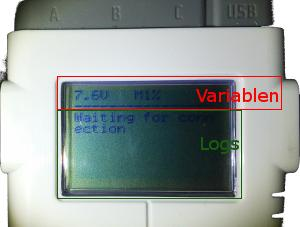
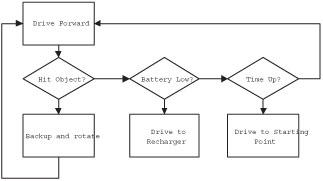
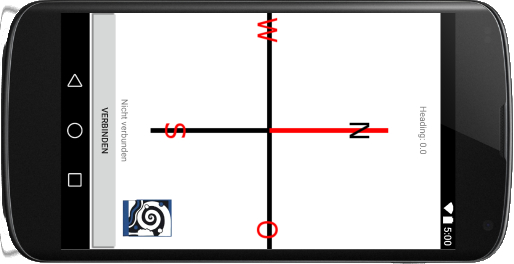

# DiscoveryVehicle
Projekt für WRO 2015 - Autonomes Fahrzeug mittels leJOS

##1. Grundlegende Technologien und Komponenten

Unser Roboter basiert auf leJOS (NXJ 0.9.1 beta). leJOS ist ein freies Betriebssystem für den NXT auf Basis von Java (realisert mittels TinyVM). leJOS erlaubt die Programmierung von Programmen für den NXT (bzw. RCX und EV3) auf Basis von Java. Dazu wurden einige Kernelemente für die schwächere Leistung des NXT und dessen geringeren Speichers gegenüber regulären Computern portiert. Gegenüber der originalen NXT-Firmware, welche die Programmierung mittels NXT-G vorsieht, einer abgewandelten und angepassten Version von LabView, bietet leJOS einige Vorteile. Neben den Vorteilen von Java als Programmiersprache, wie Objektorientierung und einer nahezu uneingeschränkten Plattformunabhängigkeit, stellt leJOS einige umfangreiche Bibliotheken bereit, welche die Implementierung von komplexen Themen und Methoden wie Navigation, Odometrie oder Mapping erheblich erleichtern.

Aufgrund dieser Eigenschaften und Vorteilen gegenüber anderen Lösungen wie NXT-G oder NXC viel unsere Wahl recht schnell auf leJOS. Eines der Hauptargumente für diese Wahl war die Möglichkeit Code plattformübergreifend nutzen zu können, also z.B. auch auf Windows oder Android.

Trotz der mittlerweile für den NXT eingestellten Entwicklung und des Beta-Stadiums befindet sich leJOS NXJ in einem ausreichend stabilen und zuverlässigen Stadium. Zahlreiche Tools und Plugins helfen beim Erstellen, Kompilieren und Übertragen der eigenen Programme und bieten darüber hinaus auch einige sehr gut ausgebaute Funktionen zur Fehlersuche bzw. -behebung. 

Unsere Entwicklungsumgebung setzt sich aus Git zur Versionsverwaltung, sowie Eclipse und IntelliJ IDEA (bzw. Android Studio) gemeinsam als integrierte Entwicklungsumgebungen für Java zusammen. Dabei setzen wir Eclipse aufgrund der sehr guten Integration von leJOS für alle NXJ spezifischen Tätigkeiten und IntelliJ IDEA für sonstige Komponenten wie unsere Android-App ein.

Eine Spiegelung unseres Quellcodes befindet sich frei verfügbar auf [github.com/Fit-AG](https://github.com/Fit-AG) unter der MIT-Lizenz, diese Lizenz erlaubt im Wesentlichen die uneingeschränkte Nutzung und Veränderung von Software, sofern jeder Kopie der Urheberrechtsvermerk beigelegt wird. 

##2. Aufbau, Projektstruktur und Abhängigkeiten

Das Projekt gliedert sich in mehrere Komponenten, die folgende Grafik beschreibt deren Struktur:



Dabei wird das Projekt *"DiscoveryVehicle"* in drei Komponenten untergliedert: *Android*, *NXT* und *Common*. Jede Komponente ist eigenständig und kann theoretisch alleine stehen, jedoch besitzen die Komponenten *Android* und *NXT* eine Abhängigkeit *(unter Entwicklern engl. “dependency”)* von der *Common*-Komponente, beinhalten also dessen Code. Jede Komponente enthält Unterprojekte bzw. Pakete. 

Die *Android*-Komponente beinhaltet unsere App *"DiscoveryVehicleRemote"*, welche die *pccomm* Bibliothek von leJOS als Abhängigkeit besitzt. Die *NXT*-Komponente beinhaltet unser eigentliches Programm *“DiscoveryVehicle”* und die *Common*-Komponente beinhaltet unsere *Communication*-Schnittstelle, welche mit Hilfe einer einfachen API eine einheitliche Kommunikation zwischen verschiedenen parallel ausgeführten Komponenten ermöglicht, also einfach nur dafür sorgt, dass unsere App und unser Roboter miteinander kommunizieren können.

Diese Schnittstelle basiert auf JSON, einem kompakten Datenformats zum Zweck des Datenaustauschs zwischen Anwendungen. JSON wurde durch [minimal-json](https://github.com/ralfstx/minimal-json), einem freien unter MIT-Lizenz stehenden hochperformanten und kleinen JSON-Parser implementiert. Aufgrund einer kleinen Inkompatibilität zu leJOS, musste der Parser jedoch für den NXT etwas angepasst werden.

Desweiteren beginnt der eigentliche Sourcecode jedes Unterprojekts mit der Ordnerstruktur:

> *src/main/java/de/ohg/fitag/* Komponente */* Unterprojekt

Diese Struktur lässt sich in der *Android*-Komponente jedoch erst im Unterordner */app/* finden.

## 3. Die NXT-Komponente

Die *NXT*-Komponente beinhaltet unser eigentliches Programm *"DiscoveryVehicle"* für den NXT und übernimmt die komplette Steuerung des Roboters. Sie implementiert die Klassenbibliothek leJOS NXJ. Demnach erfüllt die Komponente das Ziel, den Roboter selbständig und intelligent durch ein Areal zu steuern. Diese Steuerung wird mithilfe einer Art “Mäander-Algorithmus” realisiert. Zusätzlich werden mithilfe unseres selbstentwickelten Feuchtigkeitssensors regelmäßig Bodenmessungen durchgeführt und Funde von Wasser akustisch bekanntgegeben. Zusätzlich wird eine Benachrichtigung an unsere App mittels Bluetooth übermittelt. In diesem Kapitel werde ich näher auf die Modifikation des Programms und dessen Aufbau eingehen.

###A. Aufbau und Funktionen

Das Programm besteht aus drei nicht näher zugeordneten Klassen und fünf untergeordneten Ordnern (in Java "Pakete" genannt).



Dabei dient die Klasse DiscoveryVehicle als Hauptklasse, sie verwaltet alle wichtigen Objekten und dient dem Programm als Einstiegspunkt.

Die Configuration Klasse stellt Optionen und statische Variablen bereit, welche einfach und schnell geändert werden können, ohne tief in den Code eingreifen zu müssen.

Die Klasse EmergencyShutdown stellt einen eigenen Thread (engl. "Ablauf") dar und überwacht das Programm auf den Tastendruck ESCAPE (die kleinere graue Taste unter dem orange farbenen ENTER Button auf dem NXT) und Fehlermeldungen, beispielsweise eine eingehende Nachricht von der App und löst bei Bedarf das Beenden des Programms aus.

Das Utils Package stellt einige Funktionen (in Java "Methoden" genannt) zur Verfügung, die keiner Klasse besonders zugeordnet werden müssen und immer wieder praktische Verwendung finden können.

Das Sensor Package enthält die Implementierungen von eigenen Sensoren, also zum Beispiel unseren Feuchtigkeitssensor.

Das Navigation Package enthält alle relevanten Klassen die der Navigation und Fortbewegung des Roboters dienen.

Das Monitor Package enthält eine Schnittstelle, welche die Überwachung von Aktionen zur verbesserten Fehlererkennung und -korrektur ermöglicht.

Das Behaviors Package enthält verschiedene Verhaltensweisen, die der Roboter bei bestimmten Gegebenheiten ausführt.

Auf einige wichtigen Pakete und Klassen werde ich in den folgenden Kapiteln noch tiefer eingehen.

###B. Modifkation bestehender Parameter und Werte - Die Configuration Klasse

Über die Configuration Klasse können einfach Änderungen an Variablen vorgenommen werden, ohne sich durch den gesamten Sourcecode quälen zu müssen. Dafür enthält die Configuration Klasse einige statische Variablen. Durch das Ändern der Werte lassen sich schnell unterschiedliche Wirkungen  im gesamten Programm erzielen.



Das Ändern der Werte findet auf der rechten Seite des = Operators statt. Gelöscht werden sollten die Variablen nicht, da auf sie im gesamten Programm zugegriffen werden kann und so eine tiefgreifende Änderung notwendig wäre, um wirklich alle Aufrufe der Variablen zu finden und zu entfernen.

Bei den Variablen handelt es sich um frei sichtbare, statische und finale Variablen. Auf sie kann also im gesamten Projekt von jeder Klasse aus ohne Instanz zugegriffen werden. Diese Variablen sind also Konstanten, da sie ihren Wert nicht verändern können und auf sie auch ohne Instanz zugegriffen werden können.

Gemäß der Java Code-Konventionen werden Konstanten in GROSSSCHRIFT (engl. "uppercase") deklariert. Diese Konventionen geben einige Grundsätze und Verhaltensweisen an, wie man Variablen, Methoden und Klassen benennen *soll*, aber nicht muss, damit Code einheitlich lesbar wird und sich fremde Entwickler leichter im eigenen Code zurechtfinden können.

Auf eine der Konstanten kann folgendermaßen aus dem Programmablauf heraus zugegriffen werden:

private float trackWidth = Configuration.TRACK_WIDTH;

###C. **Programmabläufe überwachen - Das Monitor Package**

Um Programmabläufe eleganter überwachen zu können, entwickelten wir das Monitor Package. Monitore dienen der Überwachung, und es kann verschiedene Arten von Monitoren geben. Alle Monitore bauen auf dem Monitor Interface auf, ein Monitor muss dieses Interface implementieren. Ein Interface ist keine Klasse, sondern beschreibt nur die Methoden, die eine Klasse implementieren muss - Also ein Interface ist eine Art Vorlage.

Das Monitor Interface sieht folgende Methoden vor:

	
```java
public void log(String message);	- Loggt eine Nachricht, die der Monitor verwalten kann

public void store(Data data);		- Speichert eine Data Objekt, quasi eine Variable

public Data get(String key);		- Gibt ein vorhandenes Data Objekt zurück
```

Kernelement des Monitor Package ist die ScreenMonitor Klasse. Sie stellt die Lognachrichten und Data Objekte auf dem Display dar.



###D. **Verhaltensweisen - Behavior-based robotics**

Normalerweise arbeiten viele Roboter mit einfachen Schleifen. Dabei durchläuft der Roboter immer wieder eine Schleife und arbeitet mithilfe von strikten WENN und DANN Abfragen Aktionen und Verhaltensweisen ab. Durch einen solchen Aufbau entsteht nicht nur ein ziemlich unübersichtliches Programm (genannt "Spaghetti-Code"), sondern bereits kleine Änderungen machen zahlreiche Anpassungen in anderen WENN und DANN Abfragen nötig.

**Behavior-based robotocis** stellt dabei einen Programmieransatz dar, bei der jede Verhaltensweise durch eine Behavior dargestellt wird. Grundsätzlich sind Behavior voneinander unabhängig und werden durch einen Arbitrator gesteuert bzw. kontrolliert. Dabei wird jeder Behavior eine Priorität zugeordnet. Der Arbitrator frägt dabei jede Behavior der Priorität nach ab, ob sie ihre Verhaltensweise ausführen möchte und führt immer die Behavior mit der höchsten Priorität aus.

Dadurch lassen sich beliebig viele Behavior erstellen, ohne dass die Übersichtlichkeit der Programmstruktur verloren geht. Behavior-based robotocis stellt also eine ziemlich flexible Programmierweise dar.

In leJOS haben wir das Glück, dass uns eine [Behavior-Bibliothek](http://www.lejos.org/nxt/nxj/tutorial/Behaviors/BehaviorProgramming.htm) bereits zur Verfügung gestellt wird, dadurch müssen wir das obige System nicht selbst implementieren.

Die folgende Grafik stellt ein Behavior basiertes Programm nochmal dar:

Quelle: lejos.org

## 4. Die Android Komponente

Die Android Komponente enthält unsere App. Sie hängt von der *pccomm* Bibliothek von leJOS als Abhängigkeit ab, diese Bibliothek wird dafür benötigt, dass beispielsweise ein Computer eine Verbindung zum NXT herstellen kann. Die App stellt mittels Bluetooth und unserer *Communication* Schnittstelle eine Verbindung zum NXT her und misst mithilfe des im Smartphone eingebauten Magnetometers den magnetischen Nordpol (bzw. auf der Südhalbkugel den magnetischen Südpol). Die App sendet bei Veränderungen regelmäßig die aktuellen Werte des Sensors an den NXT.

Die App dürfte mit allen neueren Android Versionen kompatibel sein. Wie wir im Laufe des Projekts feststellen mussten, besitzt das Herstellen der Verbindung manchmal einige Macken und erfordert mehrere Versuche (~4-20). Dieses Problem kann aber relativ leicht gelöst werden, indem das aktive Pairing des Smartphones und NXT vor jedem Verbindungsaufbau entfernt wird.

Im folgenden Screenshot zeigen wir das Aussehen der App auf einem Nexus 4:

